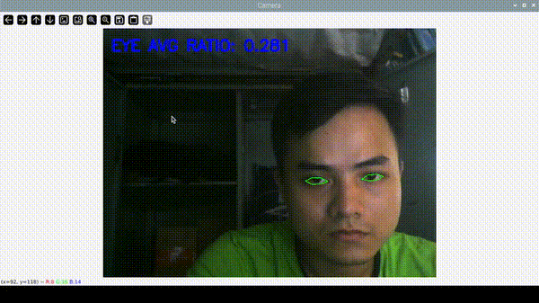
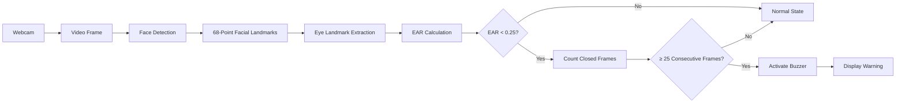

# Driver Drowsiness Detection by Using Webcam

This project presents a webcam-based driver drowsiness detection system developed as a group project for the Special Project (EL) course at Ho Chi Minh City University of Technology and Education (HCMUTE) during the 2023–2024 academic year. The system uses computer vision and facial landmark analysis to monitor the driver's eye state in real time and provide an alert when prolonged eye closure is detected.

   
  <em>Figure 1. Real-time webcam-based eye monitoring and drowsiness warning during system operation.</em>

## Overview

The system monitors the driver's eyes in real time using a webcam, facial landmarks, and the Eye Aspect Ratio (EAR). The detected eye landmarks are used to calculate the EAR for both eyes, while a predefined threshold and consecutive-frame counter are used to identify prolonged eye closure.

When the system detects sustained eye closure, it activates a GPIO-connected buzzer and displays a warning on the video stream. The project was developed as a proof-of-concept prototype focusing on camera-based eye-state monitoring and real-time drowsiness warning.

## Project Objectives

The main objectives of this project are to:

- Develop a cost-effective camera-based driver monitoring prototype.
- Detect the driver's face and eye regions in real time.
- Calculate the Eye Aspect Ratio (EAR) from facial landmarks to monitor eye closure.
- Distinguish prolonged eye closure from normal eye states using predefined thresholds.
- Provide a real-time warning through a visual message and an audible buzzer.
- Demonstrate the feasibility of webcam-based drowsiness detection as a driver-monitoring concept.

## System Architecture

The system combines camera-based computer vision with facial landmark analysis and GPIO-based warning output.

## Hardware and Software

### Hardware

The prototype uses a Raspberry Pi 4B, a Logitech C270 HD webcam, and a power bank as the main hardware components. The webcam provides the video input for facial and eye monitoring, while the Raspberry Pi and power system support the monitoring application and warning mechanism.

### Software

The system is implemented in Python using:

- **OpenCV** for image processing and face detection
- **dlib** for facial landmark detection
- **imutils** for video processing and facial landmark utilities
- **NumPy** for numerical calculations
- **gpiozero** for GPIO buzzer control

The implementation uses a Haar cascade classifier for face detection and the pretrained 68-point dlib facial landmark model for extracting facial features around the eyes.

## Drowsiness Detection Workflow

### 1. Video Capture

The webcam continuously captures video frames using a real-time video stream. Each frame is resized to a width of 450 pixels and converted to grayscale for subsequent face detection.

### 2. Face Detection

A Haar cascade classifier detects faces in each processed frame. The detected face regions are then passed to the facial landmark detector.

### 3. Facial Landmark Detection

A pretrained dlib 68-point facial landmark model identifies facial key points within the detected face. The predefined landmark indices for the left and right eyes are then extracted.

### 4. Eye Aspect Ratio Calculation

The system calculates the Eye Aspect Ratio for each eye using the vertical and horizontal distances between selected eye landmarks.

The average value of the two eyes is then used as the main indicator of eye openness.

### 5. Prolonged Eye Closure Detection

The current implementation uses an EAR threshold of `0.25`. When the average EAR falls below this value, the consecutive closed-eye counter is increased.

If the eyes remain below the threshold for at least `25` consecutive frames, the system considers the condition as sustained eye closure and triggers the warning mechanism.

### 6. Warning and Feedback

When the warning condition is reached, the GPIO-connected buzzer is activated and a warning message is displayed on the camera frame. The current EAR value is also displayed during normal monitoring.

